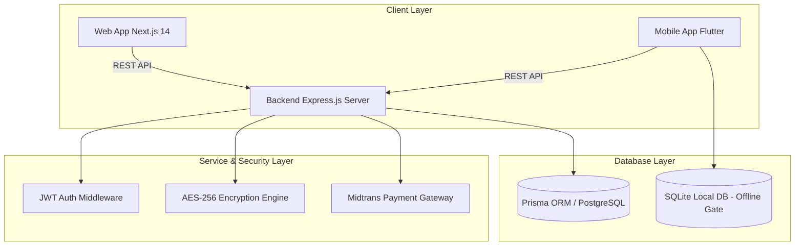

# Laporan Perancangan Aplikasi TicketFlow SaaS
**Dokumen Spesifikasi & Design Sistem (System Design Document)**

---

## 1. Pendahuluan & Latar Belakang

### 1.1 Latar Belakang
Pasar hiburan, konser musik, dan seminar di Indonesia berkembang sangat pesat. Namun, penyelenggaraan acara (event) sering menghadapi masalah teknis seperti:
- Maraknya pemalsuan tiket dan aksi calo.
- Penumpukan antrean penonton di pintu masuk (*gate*) akibat verifikasi manual.
- Transaksi jual-beli makanan/merchandise di lokasi acara yang rumit akibat uang tunai dan kembalian.

### 1.2 Tujuan Sistem
**TicketFlow** dirancang sebagai platform **SaaS (Software-as-a-Service) Ticketing & Event Management** berbasis Multi-Tenant yang menyediakan solusi end-to-end:
- **E-Ticketing Aman**: Tiket digital dengan *Dynamic QR Code AES-256* yang diperbarui otomatis.
- **Verifikasi Fast & Offline Gate**: Gate Scanner berbasis Web & Mobile dengan dukungan *Offline-First* (SQLite).
- **Ekosistem Cashless Venue**: Dompet digital (*E-Wallet*) dan integrasi *NFC Wristband* untuk transaksi cepat di booth vendor.

---

## 2. Analisis Kebutuhan Sistem (System Requirements)

### 2.1 Kebutuhan Fungsional (Functional Requirements)

#### A. Pengunjung (Customer)
- [x] Registrasi & Login akun pengunjung.
- [x] Pencarian & filter event berdasarkan kategori dan lokasi venue (Google Maps / Leaflet).
- [x] Pembelian tiket event via Payment Gateway (Midtrans: QRIS, Transfer Bank, E-Wallet).
- [x] Penggunaan Kode Promo / Voucher diskon saat checkout.
- [x] Dompet Digital (E-Wallet): Top-Up saldo dan riwayat transaksi.
- [x] Tiket Digital: Menampilkan QR Code terenkripsi AES-256 yang diperbarui otomatis.

#### B. Event Organizer (Penyelenggara Acara)
- [x] Registrasi & Login akun Organizer.
- [x] Wizard Pembuatan Event (Detail acara, tanggal, lokasi, poster/banner).
- [x] Pengaturan Zona Tempat Duduk & Harga Tiket (VVIP, VIP, Festival, Tribune).
- [x] Manajemen Kode Promo (Diskon %, Kuota, Masa Berlaku).
- [x] Dashboard Analytics: Grafik omzet penjualan, okupansi penonton, dan statistik *check-in* real-time.

#### C. Staff Gate (Petugas Pintu Masuk)
- [x] Verification Scanner: Men-scan QR Code tiket pengunjung secara cepat.
- [x] Respon Verifikasi Visual: GRANTED (Hijau), ALREADY USED (Kuning), INVALID (Merah).
- [x] Mode Offline-First: Sinkronisasi data tiket ke SQLite lokal untuk lokasi tanpa koneksi internet.

#### D. Vendor (Merchant Booth)
- [x] Registrasi Booth ke event aktif.
- [x] Pembayaran Cashless: Masukkan nominal harga -> Scan QR / Tap NFC Wristband pengunjung.
- [x] Laporan Penjualan Booth real-time.

#### E. Super Admin (Pemilik Platform SaaS)
- [x] Pengawasan transaksi platform & komisi biaya layanan (*Service Fee*).
- [x] Persetujuan pencairan dana (*Payout Withdrawal*) ke rekening Organizer & Vendor.

---

## 3. Arsitektur Sistem & Spesifikasi Teknologi

### 3.1 Stack Teknologi
- **Frontend (Web)**: Next.js 14 (App Router), TypeScript, Tailwind CSS, Framer Motion, Lucide Icons, Sonner.
- **Backend (API)**: Node.js, Express.js, Prisma ORM, JWT, Bcrypt, Crypto (AES-256).
- **Mobile (App)**: Flutter (Dart), Sqflite (SQLite), Mobile Scanner, NFC Manager.
- **Database**: PostgreSQL / MySQL (Production), Prisma Client.
- **Payment Gateway**: Midtrans Snap API (QRIS, VA Bank, Credit Card).

---

## 4. Perancangan Basis Data (Database ERD Schema)

### 4.1 Entitas Utama
1. **User**: `id`, `nama`, `email`, `password`, `role` (`pengunjung`, `organizer`, `staff`, `vendor`, `admin`), `noHp`, `createdAt`.
2. **Event**: `id`, `organizerId`, `namaEvent`, `deskripsi`, `lokasi`, `tanggal`, `kapasitas`, `isPublished`, `logoUrl`, `bannerUrl`.
3. **Seat**: `id`, `eventId`, `kategori`, `harga`, `kuota`, `terjual`, `warna`.
4. **Ticket**: `id`, `eventId`, `seatId`, `userId`, `qrToken`, `status` (`booking`, `lunas`, `check_in`, `expired`), `checkInAt`.
5. **Wallet**: `id`, `userId`, `saldo`, `nfcUid`.
6. **Vendor**: `id`, `eventId`, `ownerId`, `namaBooth`.
7. **BoothTransaction**: `id`, `vendorId`, `userId`, `nominal`, `keterangan`, `status`.
8. **PromoCode**: `id`, `eventId`, `kode`, `diskon`, `isPercentage`, `kuota`, `terpakai`, `berlakuSampai`.

---

## 5. Matriks Alur Pengguna (User Flow)

1. **Alur Pembelian Tiket**: `Pilih Event` ➔ `Pilih Zona Tiket` ➔ `Input Kode Promo` ➔ `Bayar via Midtrans` ➔ `Status LUNAS` ➔ `QR Tiket Terbit`.
2. **Alur Gate Check-In**: `Tunjukkan QR Tiket` ➔ `Staff Scan QR` ➔ `Validasi AES-256` ➔ `Status BERHASIL (Check-in)` ➔ `Pintu Terbuka`.
3. **Alur Cashless Vendor**: `Pesan Makanan` ➔ `Vendor Input Harga` ➔ `Scan QR / Tap NFC Gelang` ➔ `Potong Saldo E-Wallet` ➔ `Transaksi Sukses`.

---

**Dokumen Perancangan TiketFlow SaaS v1.0 Selesai & Terverifikasi.**
